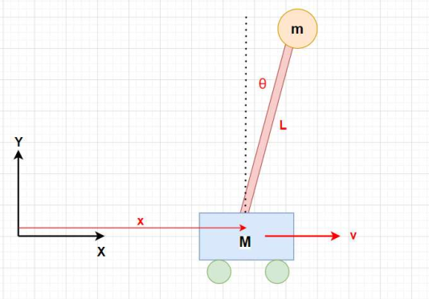
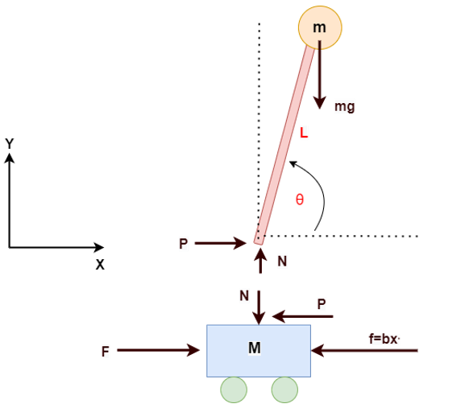
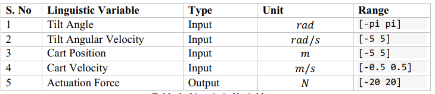
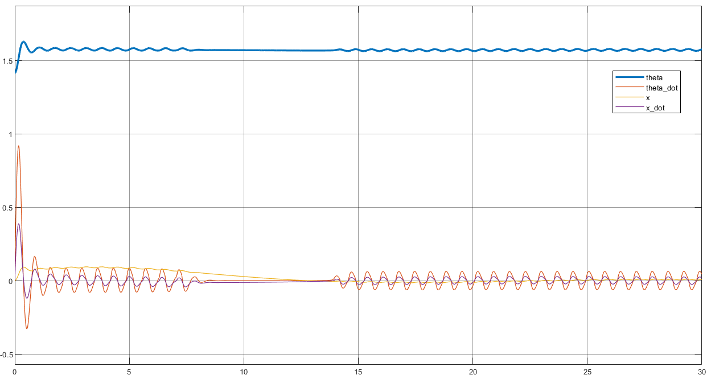

# inverted-pendulum-FIS

<<<<<<< HEAD

Inverted pendulum is an important topic in mechatronics engineering. An inverted pendulum
is an upright mass connected by a rod. The inverted pendulum can lose stability very easily and
therefore; an external force must be applied to keep it stable. The amount of external force must
depend on the tilt angle of the pendulum. The direction of the external force depends on the
direction of the tilt angle. To control the tilt angle of the inverted pendulum a controller can
designed. Some common controller types are PID controllers, On/off controllers and Fuzzy
Logic controllers. A fuzzy logic controller works on fuzzy variables with multiple membership
functions. A schematic of inverted pendulum with a movable cart is shown below:

</img>

## Free body Diagram

The free body diagram of the inverted pendulum and cart is shown below:

</img> 

## Dynamic Model
</img>

## Linguistic Varibles

Once the mathematical model is evaluated, the next step is to develop the Fuzzy Logic
Convertor for the system. The linguistic variables of interest are the cart position, cart velocity, the tilt angle and the tilt angular velocity. The output variable of the Fuzzy Logic controller is the Force applied on the cart.

 </img>

## Cart Position and Velocity
 </img>
