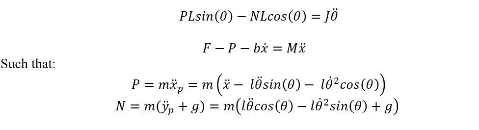

# A Robust Fuzzy Logic Controller for Inverted Pendulum Stability

Inverted pendulum is an important topic in mechatronics engineering. An inverted pendulum
is an upright mass connected by a rod. The inverted pendulum can lose stability very easily and
therefore; an external force must be applied to keep it stable. The amount of external force must
depend on the tilt angle of the pendulum. The direction of the external force depends on the
direction of the tilt angle. To control the tilt angle of the inverted pendulum a controller can
designed. Some common controller types are PID controllers, On/off controllers and Fuzzy
Logic controllers. A fuzzy logic controller works on fuzzy variables with multiple membership
functions. A schematic of inverted pendulum with a movable cart is shown below:

</img>

## Free body Diagram

The free body diagram of the inverted pendulum and cart is shown below:

</img> 

## Dynamic Model
</img>

## Linguistic Variables

Once the mathematical model is evaluated, the next step is to develop the Fuzzy Logic
Convertor for the system. The linguistic variables of interest are the cart position, cart velocity, the tilt angle and the tilt angular velocity. The output variable of the Fuzzy Logic controller is the Force applied on the cart.

| S.No     | Lingusitic Var   |  Type    |  Unit   | Range      |
| -------- | -------          |  ------- | ------- | -------    |     
| 1        | Tilt Angle       |   Input  |   rad   | [-pi pi]   |
| 2        | Tilt Velocity    |   Input  |  rad/s  |  [-5 5]    |
| 3        | Cart Position    |   Input  |   m     | [-5 5]     |
| 4        | Cart Velocity    |   Input  |   m/s   | [-0.5 0.5] |
| 5        | Actuation Force  |   Output |  newton | [-20 20]   |

## Simulink Model

The Simulink model is built by using multiple blocks like integrator, gain, MATLAB function, constant and mux etc. The system mechanical model is implemented using the blocks while the quantities N and P are computed using a MATLAB functions. Finally, a Fuzzy Logic Controller is placed to close the feedback loop. The input to the Fuzzy Logic Controller is the Pendulum angle, angular velocity, cart position and cart linear velocity. The output of the Controller is the Force applied to the cart.

</img>

## Cart Position and Velocity
 </img>
